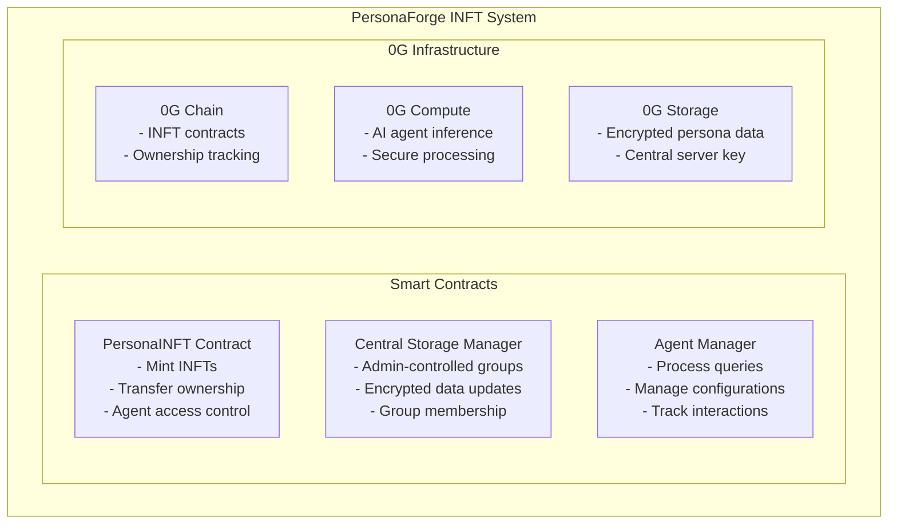

# PersonaINFT - Intelligent NFTs for AI Agents

## Overview

PersonaINFT is a simplified implementation of Intelligent NFTs (INFTs) designed specifically for the PersonaForge ecosystem. Unlike traditional ERC-7857 implementations that require complex TEE/ZKP re-encryption during transfers, PersonaINFT focuses on **agent access control** rather than data ownership transfer.

## Key Features

### 🎯 **Agent Access Control**

- INFTs grant access to AI agents, not raw data
- Only NFT holders can interact with their assigned AI agent
- Simple ownership transfers without data re-encryption

### 🏛️ **Central Storage Management**

- Admin-controlled encrypted storage groups
- Data updates don't affect NFT ownership
- Encrypted using central server public key
- Integrated with 0G Storage for decentralized storage

### 🤖 **AI Agent Integration**

- Each INFT is controlled by an AI agent
- Agents process queries through 0G Compute
- Personalized responses based on individual traits
- Interaction history and statistics tracking

### 🔒 **Simplified Security Model**

- No complex TEE/ZKP requirements
- Central encryption key management
- Role-based access control
- Admin-controlled data updates

## Architecture



## Contract Architecture

### 1. PersonaINFT.sol

The main NFT contract that implements simplified INFT functionality:

**Key Functions:**

- `createPersonaGroup()` - Create a new persona group
- `mintPersonaINFT()` - Mint NFT with agent access
- `transferFrom()` - Simple NFT transfer without data re-encryption
- `interactWithAgent()` - Interface with AI agent (token holders only)

**Data Structures:**

```solidity
struct PersonaGroup {
    string name;
    address admin;
    string encryptedDataURI;  // 0G Storage URI
    bytes32 dataHash;
    uint256 lastUpdated;
    bool isActive;
}

struct PersonaToken {
    uint256 groupId;
    string personalityTraits;
    uint256 mintedAt;
    uint256 lastInteraction;
    bool isActive;
}
```

### 2. PersonaStorageManager.sol

Manages centralized encrypted storage for persona data:

**Key Functions:**

- `createStorageGroup()` - Create new storage group
- `updatePersonaData()` - Update encrypted data (admin only)
- `addAuthorizedUpdater()` - Manage update permissions
- `getUpdateHistory()` - Track data changes

**Features:**

- Admin-controlled data updates
- Version tracking and history
- Authorized updater management
- Integration with 0G Storage

### 3. PersonaAgentManager.sol

Handles AI agent interactions and configurations:

**Key Functions:**

- `processQuery()` - Process user queries through 0G Compute
- `updatePersonaConfig()` - Configure agent personality
- `getInteractionHistory()` - View past interactions
- `hasAgentAccess()` - Verify access permissions

**Features:**

- 0G Compute integration
- Interaction history tracking
- Agent statistics and monitoring
- Access control enforcement

## Usage Examples

### 1. Deploy Contracts

```bash
# Set environment variables
export PRIVATE_KEY="your-private-key"
export OG_RPC_URL="https://evmrpc-testnet.0g.ai"

# Deploy contracts
forge script script/Deploy.s.sol --rpc-url $OG_RPC_URL --broadcast --verify
```

### 2. Create Persona Group

```solidity
// Create storage group
uint256 groupId = storageManager.createStorageGroup(
    "AI Assistant Persona",
    keccak256("encryption-key-hash"),
    "0g://storage/persona-data-123",
    keccak256("encrypted-data")
);

// Create persona group
uint256 personaGroupId = personaINFT.createPersonaGroup(
    "AI Assistant Persona",
    "A helpful AI assistant",
    "0g://storage/persona-data-123",
    keccak256("encrypted-data")
);
```

### 3. Mint PersonaINFT

```solidity
uint256 tokenId = personaINFT.mintPersonaINFT(
    userAddress,
    personaGroupId,
    "Helpful, professional, detail-oriented"
);
```

### 4. Interact with AI Agent

```solidity
string memory response = personaINFT.interactWithAgent(
    tokenId,
    "Hello, can you help me with project planning?"
);
```

### 5. Transfer PersonaINFT

```solidity
// Simple transfer - no data re-encryption needed
personaINFT.transferFrom(currentOwner, newOwner, tokenId);

// New owner can now access the agent
bool hasAccess = agentManager.hasAgentAccess(tokenId, newOwner);
```

### 6. Update Persona Data

```solidity
// Only admin can update the central data
storageManager.updatePersonaData(
    groupId,
    "0g://storage/updated-data-456",
    keccak256("new-encrypted-data"),
    "Added new training data"
);

// Update persona group to reflect changes
personaINFT.updatePersonaGroup(
    personaGroupId,
    "0g://storage/updated-data-456",
    keccak256("new-encrypted-data")
);
```

## Key Differences from ERC-7857

| Feature              | ERC-7857                           | PersonaINFT                          |
| -------------------- | ---------------------------------- | ------------------------------------ |
| **Data Transfer**    | Complex re-encryption with TEE/ZKP | No data transfer, only access rights |
| **Storage Model**    | Per-NFT encrypted storage          | Central admin-controlled storage     |
| **Transfer Process** | Requires proof generation          | Simple NFT transfer                  |
| **Access Control**   | Owner can decrypt data             | Owner can access AI agent            |
| **Data Updates**     | Requires owner interaction         | Admin-controlled updates             |
| **Complexity**       | High (cryptographic proofs)        | Low (standard NFT + access control)  |

## Security Considerations

### ✅ **Advantages**

- **Simplified Architecture**: No complex cryptographic proofs required
- **Central Management**: Admin can update and maintain persona data
- **Scalable**: Easy to add new personas and update existing ones
- **0G Integration**: Leverages 0G's decentralized infrastructure

### ⚠️ **Trade-offs**

- **Trust Requirement**: Users must trust central admin for data updates
- **No Data Portability**: Raw data doesn't transfer with NFT
- **Admin Dependency**: Data updates require admin intervention
- **Central Point**: Admin controls data access (mitigated by 0G Storage)

## Use Cases

### 1. **AI Personality Marketplaces**

- Trade access to different AI personalities
- Collect and use various AI agents
- Creator economies around AI personas

### 2. **Corporate AI Assistants**

- Company-maintained AI knowledge bases
- Employee access through NFT ownership
- Centralized updates and improvements

### 3. **Educational AI Tutors**

- Subject-specific AI tutors as NFTs
- Student ownership and access
- Teacher-controlled content updates

### 4. **Gaming AI Companions**

- Unique AI companions as game assets
- Player ownership and trading
- Game developer-controlled updates

## Development and Testing

### Setup

```bash
# Install dependencies
forge install

# Build contracts
forge build

# Run tests
forge test

# Deploy to testnet
forge script script/Deploy.s.sol --rpc-url og_testnet --broadcast
```

### Environment Variables

```bash
export PRIVATE_KEY="your-private-key"
export OG_RPC_URL="https://evmrpc-testnet.0g.ai"
export PERSONA_INFT_ADDRESS="deployed-contract-address"
export STORAGE_MANAGER_ADDRESS="deployed-contract-address"
export AGENT_MANAGER_ADDRESS="deployed-contract-address"
```

## Integration with 0G

### 0G Storage

- Stores encrypted persona data
- Decentralized and tamper-proof
- Cost-effective for large datasets

### 0G Compute

- Processes AI agent queries
- Secure inference environment
- Scalable compute resources

### 0G Chain

- Hosts smart contracts
- Manages NFT ownership
- Handles access control

## Future Enhancements

1. **Multi-Agent Collaboration**: Allow multiple personas to work together
2. **Advanced Personality Traits**: More sophisticated personality modeling
3. **Learning Mechanisms**: Agents that learn from interactions
4. **Marketplace Integration**: Built-in trading and discovery features
5. **Cross-Chain Support**: Deploy on multiple chains
6. **DAO Governance**: Community-controlled persona development

## License

MIT License - See LICENSE file for details.

## Contributing

1. Fork the repository
2. Create a feature branch
3. Make your changes
4. Add tests
5. Submit a pull request

## Support

- **Documentation**: See this README and inline code comments
- **Issues**: Report bugs and request features via GitHub issues
- **Community**: Join our Discord for discussions

---

**PersonaINFT** - Bringing AI agents to the NFT world with simplicity and scalability.
