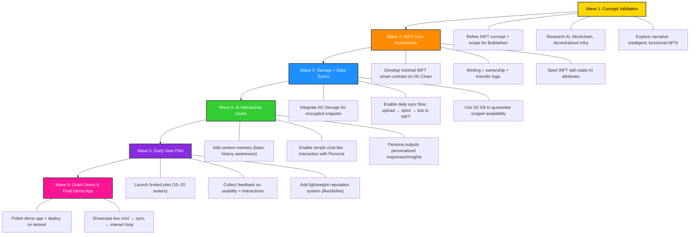

# PersonaForge – Living Individuals but, Digital

## Core Concept

PersonaForge is a decentralized platform for building and owning **AI-powered digital identities** ("Persona Agents") as **Intelligent NFTs (INFTs)**.

These aren’t static profiles – they **evolve over time** with your inputs, experiences, and data. Your Persona Agent becomes a living extension of you:

- It learns your style, preferences, and history.
- It interacts trustlessly with others onchain.
- It produces personalized insights, recommendations, and connections.

The idea is simple but powerful:

Every day, you “sync” with your Persona Agent by uploading small life snippets (thoughts, notes, achievements). In return, it surprises you with personalized outputs like curated opportunities, foresight notes, or meaningful new connections.

This creates a habit loop similar to notifications on Web2 apps – but instead of doomscrolling, you’re **actively evolving your digital self**.

---

## Why Onchain and Why 0G?

- **True Ownership** – Your persona is minted as an INFT. You own it, transfer it, or even merge it with others. No platform lock-ins like LinkedIn or [Character.AI](http://character.ai/).
- **Censorship Resistance** – The AI evolution runs on 0G Compute. Nobody can shut down, censor, or bias how your identity grows.
- **Scalable and Private** – All personal and interaction data lives on 0G Storage, encrypted and cheap. Unlike Web2 silos, your data is secure and portable.
- **Dynamic Agents, Not Static Profiles** – Social platforms today give you a profile page. PersonaForge gives you a **thinking agent that acts on your behalf**.

---

## Use Cases (Solving Real-World Problems)

The use cases have a wide spectrum, these are only some of them.

### 1. Personal AI Assistant

Your Persona Agent becomes your perfect digital secretary. Since it’s trained only on your data and preferences:

- Drafts emails and replies exactly how you would.
- Reminds you of commitments in your tone.
- Suggests collaborations or communities aligned with your personal growth.

This is different from Siri or ChatGPT because it **is you** – your style, your history, your voice.

---

### 2. Influencer / Celebrity INFTs

Famous personalities can mint Persona INFTs that evolve under their guidance.

- Fans and followers can interact with the “living AI version” of them.
- These INFTs become **value-holding digital assets**, tradable and maintainable.
- Credibility is ensured by onchain history + like/dislike system.

This opens up new **creator economies** where personalities literally sell access to their digital extensions.

---

### 3. Mentorship & Knowledge Transfer

Imagine a small-town doctor purchasing or receiving a mentor’s Persona INFT.

- The INFT has absorbed years of medical expertise, case handling, and judgment patterns.
- The young doctor can query it for trusted guidance.

This scales across professions: a budding lawyer, a craftsman, or even students learning from their professors’ maintained Persona INFTs.

---

### 4. Heritage & Legacy INFTs

Families can pass down Persona Agents through generations.

- A grandparent’s INFT retains their wisdom, experiences, and personality.
- Future generations interact with it to learn values, family stories, or even practical know-how.

This solves the problem of **lost human knowledge** that dies with people.

---

### 5. Enterprise / Team Personas

Teams can merge INFTs into a **collaborative persona**.

- A startup creates an “Org Agent” that carries the memory of decisions, culture, and expertise.
- New employees sync with it instead of reading endless documents.
- Businesses can even sell or share “Partner INFTs” for smoother collaborations.

---

### 6. Multi-Agent Collaboration

A user can orchestrate **multiple Persona INFTs working together** like a digital team.

- Example: A *Dev INFT* + *PM INFT* + *Tester INFT* collaborate to simulate a small product team.
- For personal use: a *Fitness INFT* + *Diet INFT* + *Therapy INFT* coordinate to deliver holistic lifestyle guidance.
- For enterprises: rapid prototyping with AI teams before scaling to human execution.

This creates **instant digital workforces**, unlocking both fun and enterprise-grade productivity.

---

### 7. Community Knowledge Pools

Communities or DAOs can create shared Persona Agents.

- Example: A DAO creates an “Ecosystem Agent” that curates all proposals, discussions, and histories.
- Members query it for fast answers instead of sifting through documents.
- This builds living community memory.

---

### 8. Personality Markets

For fun and experimentation, users could **trade experimental personas** – e.g., “Shakespeare-style AI,” “Zen Monk Persona,” or “Startup Hustler Persona.”

People adopt and interact with them as companions or even co-pilots for creative work.

Unlike [Character.AI](http://character.ai/), these personas are **ownable, verifiable, and transferable**.

---

## Key Features

- **Mintable Persona INFTs**
  - One-click minting on 0G Chain.
  - Seeded with initial inputs and encrypted AI metadata.

- **Daily Syncs**
  - Users upload quick snippets.
  - 0G Compute generates insights, recommendations, or connections.
  - Over time, your Persona grows richer and more accurate.

- **Agent-to-Agent Interactions**
  - INFTs can handshake with each other onchain.
  - They auto-match and suggest meaningful human connections.

- **Like / Dislike Credibility System**
  - Holders of a Persona INFT can leave a **1-time like or dislike per wallet**.
  - This rating system acts as a credibility marker.
  - Helps new buyers know whether the INFT truly represents the person and is being maintained.

- **Privacy Controls**
  - All data encrypted in 0G Storage.
  - Users choose what to share publicly vs. privately.

---

## Transfer & Merge

- **Transfer**
  - A persona INFT can be transferred between users or wallets, enabling portability of reputation, skills, or progress.
  - Example: A player can sell, gift, or delegate their persona to another user while retaining the full history of actions, attributes, and achievements.

- **Merge**
  - Multiple personas can be merged into a new composite INFT.
  - Use cases:
    - **Team INFTs**: Individual personas contribute attributes, achievements, and resources to form a collective identity (e.g., a DAO, esports team, or project squad).
    - **Legacy Passing**: A persona can be “inherited” by another (family member, successor, or protégé), ensuring continuity of reputation and history beyond a single owner.
    - **Evolutionary Growth**: Older or less active personas can be merged into a primary one, strengthening it while preserving historical lineage.

---

## Motivation for iNFT Makers/Maintainers

- With each trade of their iNFTs, they will get a small cut (5-10%) of the amount of iNFT sold.
- The interface will also have a donation section for each iNFT in which consumers of those iNFTs can donate to tip the makers/maintainers of them.
- The interface of the Makers/Maintainers will be similar to that of an online journal. Many people write journals, so they can just use this to record their day-to-day activities and findings (along with audio files, photos, etc.). This data will then be used (privately) for the memory of the iNFTs and can also be reviewed by the maker after some time, fulfilling their side role of a journal.

This way maintaining the iNFTs will not feel like an “extra burden” to add to your daily routine and will also reward you.

---
## Roadmap (Hackathon Wave Plan)

The evolution of Intelligent NFTs (INFTs) can be visualised in **waves of adoption**, where each wave unlocks more complex and impactful use cases.

---

---
### Wave 1: Concept Validation - Completed ✅

- Brainstorm & validate INFT concepts
- Explore narrative: intelligent, functional NFTs
- Research AI, blockchain, decentralized infra

---

### Wave 2: INFT Core Architecture

- Develop minimal INFT smart contract on 0G Chain
- Minting + ownership + transfer logic
- Seed INFT with static AI attributes

---

### Wave 3: Storage + Data Syncs

- Integrate 0G Storage for encrypted snippets
- Enable daily sync flow: upload → store → link to INFT
- Use 0G DA to guarantee snippet availability

---

### Wave 4: AI Interactivity Demo

- Add context memory (basic history awareness)
- Enable simple chat-like interaction with Persona
- Persona outputs personalized responses/insights

---

### Wave 5: Early User Pilot

- Launch limited pilot (10–20 testers)
- Collect feedback on usability + interactions
- Add lightweight reputation system (like/dislike)

---

### Wave 6: Grant Demo & Final Demo App

- Polish demo app + deploy on testnet
- Showcase live mint → sync → interact loop

---

### Beyond Wave 6: Future Scalability

Even after these waves, there is a **wide scope of future scalability**.

We can then start developing on **specific use cases (demanded by the community or DAO)** such as:

- **Doctor’s iNFT** → Pre-defined “Doctory questions” during minting/settings for highly personalized doctor roles.
- **Legacy Setting for Persona iNFTs** → Store trustee addresses to whom iNFTs (and linked vault funds) get transferred upon inactivity/death (based on inactivity period or trustee voting).
- **Specialized Roles** → Engineer, teacher, personal assistant, etc., where iNFTs are optimized for specific functions.
- **Vault Integration** → Link iNFTs with secure vaults for fund distribution tied to legacy settings.
- **Community-Driven Additions** → Feature expansion based on DAO governance and feedback.

**And many more...**

---
## PersonaForge Tech Stack (Powered by 0G)

- **0G Chain**
    - Hosts the **Persona INFTs** as smart contracts on an **EVM-compatible chain**.
    - Handles minting, ownership, transfers, merging, and credibility (like/dislike) logic.
- **0G Compute**
    - Runs **AI inference and personalization** for Persona Agents.
    - Processes user syncs (text, audio, notes) into evolving persona traits, insights, and recommendations.
- **0G Storage**
    - Stores **encrypted personal data, history, and persona metadata**.
    - Ensures long-term, cheap, and portable data management beyond centralized silos.
- **0G Data Availability (DA)**
    - Guarantees that all persona syncs and interaction data are **verifiably available** for validation and future interactions.
    - Enables **scalability** as thousands of users upload daily snippets without bottlenecks.
---
## Why This Works for Early 0G

- **User Magnet** – Frictionless onboarding: mint and sync in minutes.
- **Viral Growth** – Public “Persona Echoes” can be shared offchain to attract friends.
- **Onchain Utility** – Every sync triggers storage, compute, and INFT updates, driving mainnet usage.
- **Habit Loop** – Returning daily for surprises keeps engagement high.
