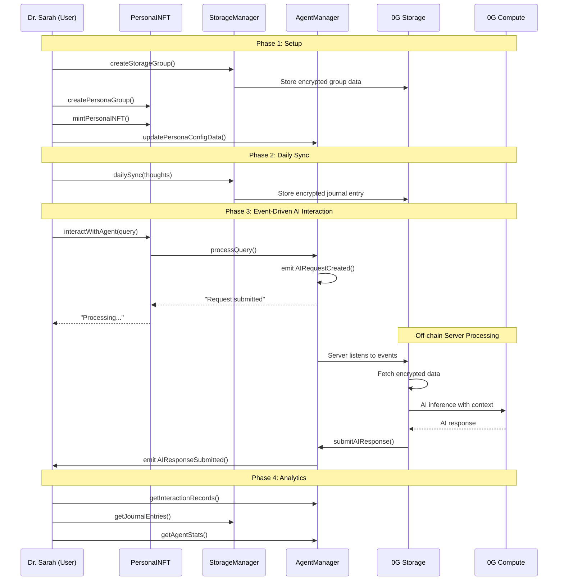

# PersonaForge Smart Contracts

This directory contains the complete smart contract implementation for **PersonaForge**, a decentralized platform for AI-powered digital identities as **Intelligent NFTs (INFTs)**. Built on the **0G ecosystem**, these contracts enable users to mint, manage, and interact with evolving AI personas that are truly owned, transferable, and privacy-preserving.

## 🏗️ Architecture Overview

The PersonaForge system consists of three main smart contracts that work together to provide a comprehensive INFT experience:

```mermaid
graph TB
    subgraph "0G Chain (EVM-Compatible)"
        A[PersonaINFT.sol<br/>🎯 Core INFT Contract]
        B[PersonaStorageManager.sol<br/>🗄️ Encrypted Data Storage]
        C[PersonaAgentManager.sol<br/>🤖 AI Agent Interface]
    end

    subgraph "0G Infrastructure"
        D[0G Storage<br/>📦 Encrypted Data]
        E[0G Compute<br/>⚡ AI Inference]
        F[0G DA<br/>🌐 Data Availability]
    end

    subgraph "User Interactions"
        G[👤 Users]
        H[🖥️ dApp Frontend]
    end

    A -.-> B
    A -.-> C
    B <--> D
    C <--> E
    A <--> F

    G --> H
    H --> A
    H --> B
    H --> C

    style A fill:#ff6b6b
    style B fill:#4ecdc4
    style C fill:#45b7d1
    style D fill:#96ceb4
    style E fill:#ffeaa7
    style F fill:#dda0dd
```



## 📁 Contract Structure

### Core Contracts (`/src/`)

#### 1. **PersonaINFT.sol** 🎯

_The heart of the PersonaForge ecosystem_

**Purpose**: Main ERC-721 contract that implements Intelligent NFTs (INFTs) with AI agent capabilities.

**Key Features**:

- **INFT Minting**: Creates unique AI personas as NFTs
- **Group Management**: Organizes INFTs into themed collections (e.g., "Medical AI", "Creative Writers")
- **AI Integration**: Direct interface to AI agents for persona interactions
- **Access Control**: Role-based permissions for group admins and system administrators
- **Lifecycle Management**: Activate/deactivate groups and individual tokens

**Core Functions**:

```solidity
// Group Management
function createPersonaGroup(string name, string description, string dataURI, bytes32 dataHash) → uint256
function updatePersonaGroup(uint256 groupId, string name, string description, string dataURI, bytes32 dataHash)

// INFT Minting & Management
function mintPersonaINFT(address to, uint256 groupId, string personalityTraits) → uint256
function interactWithAgent(uint256 tokenId, string query) → string

// Access Control
function canAccessAgent(uint256 tokenId, address requester) → bool
```

**Integration Points**:

- **→ PersonaStorageManager**: Links each group to encrypted storage groups for data persistence
- **→ PersonaAgentManager**: Routes AI interactions to the agent management system
- **→ 0G Infrastructure**: Updates metadata and interaction logs to 0G DA

#### 2. **PersonaStorageManager.sol** 🗄️

_Decentralized encrypted storage orchestrator_

**Purpose**: Manages encrypted storage groups on 0G Storage, handles data updates, and implements the Daily Sync functionality.

**Key Features**:

- **Storage Group Creation**: Creates encrypted storage containers for persona data
- **Access Control**: Multi-role system (Storage Admin, Group Admin, Authorized Updaters)
- **Data Versioning**: Maintains complete history of all data updates
- **Daily Sync**: Implements journal entry system for continuous persona evolution
- **Encryption Management**: Handles public key updates for central server decryption

**Core Functions**:

```solidity
// Storage Management
function createStorageGroup(string name, bytes32 encryptionKeyHash, string storageURI, bytes32 dataHash) → uint256
function updatePersonaData(uint256 groupId, string newStorageURI, bytes32 newDataHash, string updateReason)

// Daily Sync Functionality
function addJournalEntry(uint256 groupId, string entryContent, string entryType)
function dailySync(uint256 groupId, string dailyThoughts)
function getJournalEntries(uint256 groupId, uint256 start, uint256 limit) → JournalEntry[]

// Access Control
function addAuthorizedUpdater(uint256 groupId, address updater)
function removeAuthorizedUpdater(uint256 groupId, address updater)
```

**Integration Points**:

- **→ 0G Storage**: Direct integration for encrypted data storage and retrieval
- **→ PersonaINFT**: Provides storage backend for persona groups
- **→ Central Server**: Encrypted data accessible only by server with private key

#### 3. **PersonaAgentManager.sol** 🤖

_AI agent interaction and configuration management_

**Purpose**: Manages AI agent configurations, processes user queries, and maintains interaction history.

**Key Features**:

- **Event-Driven AI Processing**: Emits events for off-chain AI processing via 0G Compute
- **Agent Configuration**: Stores and updates AI model parameters and personality settings
- **Interaction History**: Tracks all user-agent interactions with timestamps
- **Access Control**: Ensures only token owners can interact with their agents
- **Statistics Tracking**: Monitors agent usage and performance metrics
- **Server Response Management**: Handles AI responses from authorized off-chain servers

**Core Functions**:

```solidity
// Event-Driven AI Interaction
function processQuery(AgentRequest request) → AgentResponse // Emits AIRequestCreated event
function submitAIResponse(uint256 requestId, string response) // Server submits AI response
function getAIResponse(uint256 requestId) → string // Get processed AI response

// Agent Configuration
function updatePersonaConfigData(uint256 tokenId, string configData)

// History & Analytics
function getInteractionRecords(uint256 tokenId, uint256 start, uint256 limit) → InteractionRecord[]
function getAgentStats(uint256 tokenId) → AgentStats

// System Configuration
function updateOGComputeConfig(address computeAddress, string agentModelEndpoint)
function addAuthorizedCaller(address caller)
```

**Integration Points**:

- **→ Off-chain Server**: Emits events for off-chain AI processing via 0G Compute
- **→ PersonaINFT**: Validates token ownership and retrieves persona data
- **→ PersonaStorageManager**: Provides encrypted data URIs for server processing

### Interface Contracts (`/src/interfaces/`)

#### **IPersonaAgent.sol** 🔌

_Standardized AI agent interface_

Defines the standard interface for AI agent interactions, ensuring compatibility and extensibility:

```solidity
struct AgentRequest {
    uint256 tokenId;
    address requester;
    string query;
    uint256 timestamp;
    bytes context;
}

struct AgentResponse {
    string response;
    uint256 timestamp;
    bytes metadata;
}

struct PersonaConfig {
    string description;
    uint256 lastInteraction;
}
```

#### **IERC7857.sol** 📋

_INFT standard interface_

Implements the ERC-7857 standard for Intelligent NFTs (simplified version without TEE/ZKP):

```solidity
interface IERC7857 {
    function getAgent(uint256 tokenId) external view returns (address);
    function interactWithAgent(uint256 tokenId, string calldata query) external returns (string memory);
    // Additional INFT-specific functions
}
```

## 🔄 System Integration Flow

### 1. **INFT Creation Flow**

```
User Request → PersonaINFT.createPersonaGroup() → PersonaStorageManager.createStorageGroup() → 0G Storage
     ↓
PersonaINFT.mintPersonaINFT() → PersonaAgentManager.updatePersonaConfigData() → 0G Compute
```

### 2. **Daily Sync Flow**

```
User Input → PersonaStorageManager.dailySync() → 0G Storage (encrypted)
     ↓
Central Server Decryption → AI Processing → Persona Evolution
     ↓
PersonaAgentManager.updatePersonaConfigData() → Enhanced Agent Capabilities
```

### 3. **Event-Driven AI Interaction Flow**

```
User Query → PersonaINFT.interactWithAgent() → PersonaAgentManager.processQuery()
     ↓
Emit AIRequestCreated Event → Off-chain Server Listens
     ↓
Server: Fetch 0G Storage → Decrypt → 0G Compute AI Inference
     ↓
Server: PersonaAgentManager.submitAIResponse() → User gets response
```

## 🔐 Security & Access Control

### Role-Based Access Control (RBAC)

Each contract implements a comprehensive RBAC system:

**PersonaINFT**:

- `DEFAULT_ADMIN_ROLE`: System administration
- `GROUP_ADMIN_ROLE`: Persona group management

**PersonaStorageManager**:

- `DEFAULT_ADMIN_ROLE`: System administration
- `STORAGE_ADMIN_ROLE`: Storage system management
- `GROUP_ADMIN_ROLE`: Individual group administration
- Per-group authorized updaters

**PersonaAgentManager**:

- `DEFAULT_ADMIN_ROLE`: System administration
- `ADMIN_ROLE`: Agent system management
- Authorized callers list for system integrations

### Security Features

1. **Ownership Validation**: All interactions require token ownership verification
2. **Reentrancy Protection**: OpenZeppelin's `nonReentrant` modifier on state-changing functions
3. **Input Validation**: Comprehensive checks for empty strings, zero addresses, and invalid parameters
4. **Access Control**: Multi-layered permissions with role hierarchy
5. **Data Integrity**: Hash verification for all stored data

## 🌐 0G Ecosystem Integration

### **0G Chain** ⛓️

- **Smart Contract Hosting**: All contracts deployed on EVM-compatible 0G Chain
- **Transaction Processing**: Minting, transfers, and state changes
- **Event Logging**: Comprehensive event emission for dApp synchronization

### **0G Storage** 📦

- **Encrypted Data Storage**: Personal data, journal entries, and interaction history
- **Decentralized Architecture**: No single point of failure
- **Cost Efficiency**: Affordable long-term storage for user data
- **Data Portability**: Users own and can migrate their data

### **0G Compute** ⚡

- **Off-chain AI Inference**: Real-time persona query processing via authorized servers
- **Model Hosting**: Decentralized AI model execution
- **Scalability**: Handles multiple concurrent AI interactions
- **Censorship Resistance**: No central authority can restrict AI capabilities

### **0G Data Availability** 🌐

- **Data Verification**: Ensures all persona updates are verifiable
- **Scalability**: Handles high-frequency daily sync operations
- **Integrity**: Cryptographic proofs of data availability

## 🎯 Key Innovations

### 1. **Intelligent NFTs (INFTs)**

Unlike static NFTs, PersonaForge INFTs are **living digital entities** that:

- Evolve over time based on user interactions
- Maintain conversational context and memory
- Provide personalized AI-powered responses
- Can be transferred while preserving their learned behaviors

### 2. **Daily Sync Mechanism**

The **Daily Sync** feature enables continuous persona evolution:

- Users share daily thoughts, experiences, and updates
- Data is encrypted and stored on 0G Storage
- Central server processes updates to enhance AI capabilities
- No modification of historical data (append-only journal system)

### 3. **Hybrid Privacy Model**

Balances functionality with privacy:

- **Encrypted Storage**: All personal data encrypted client-side
- **Central Processing**: Authorized server can decrypt for AI training
- **User Control**: Users control what data to share and when
- **No INFT Holder Access**: Token holders cannot access raw encrypted data

### 4. **Event-Driven AI Architecture**

Revolutionary approach to blockchain-AI integration:

- **Smart Contract Events**: Contracts emit events instead of making impossible API calls
- **Off-chain Processing**: Authorized servers handle AI inference using 0G Compute
- **Response Submission**: Servers submit AI responses back to smart contracts
- **Transparent & Auditable**: All AI requests and responses logged on-chain

### 5. **Cross-Contract State Management**

Sophisticated state synchronization across contracts:

- **Atomic Operations**: Multi-contract interactions are transaction-safe
- **Event-Driven Updates**: Contracts communicate via events
- **Consistent State**: All contracts maintain synchronized views of data

## 📖 Complete Usage Example

### End-to-End Workflow: "Dr. Sarah's Medical AI Persona"

Let's walk through a complete example of creating and using a PersonaForge INFT, following Dr. Sarah as she creates a medical AI persona for knowledge sharing.

#### **Phase 1: Initial Setup & Group Creation**

**Step 1: Deploy Contracts (Admin)**

```solidity
// 1. Deploy PersonaStorageManager
PersonaStorageManager storageManager = new PersonaStorageManager();

// 2. Deploy PersonaAgentManager
PersonaAgentManager agentManager = new PersonaAgentManager(address(storageManager));

// 3. Deploy PersonaINFT with 0G infrastructure addresses
PersonaINFT personaINFT = new PersonaINFT(
    "PersonaINFT",
    "PINFT",
    0x1234...5678, // 0G Storage address
    0xABCD...EFGH  // 0G Compute address
);

// 4. Configure cross-contract permissions
agentManager.addAuthorizedCaller(address(personaINFT));
```

**Events Emitted:**

```solidity
emit PersonaAgentManager.AuthorizedCallerAdded(address(personaINFT));
```

**Step 2: Create Medical AI Group (Dr. Sarah - Group Admin)**

```solidity
// Dr. Sarah creates a storage group for medical personas
uint256 storageGroupId = storageManager.createStorageGroup(
    "Medical AI Personas",
    keccak256("medical-encryption-key-hash"),
    "0g://storage/medical-personas/group-1",
    keccak256("initial-medical-data")
);

// Create corresponding persona group
uint256 groupId = personaINFT.createPersonaGroup(
    "Medical AI Specialists",
    "AI personas trained on medical knowledge and patient interaction",
    "0g://storage/medical-personas/group-1",
    keccak256("initial-medical-data")
);
```

**Events Emitted:**

```solidity
emit PersonaStorageManager.StorageGroupCreated(
    1, // storageGroupId
    "Medical AI Personas",
    msg.sender, // Dr. Sarah's address
    block.timestamp
);

emit PersonaINFT.PersonaGroupCreated(
    1, // groupId
    "Medical AI Specialists",
    msg.sender, // Dr. Sarah's address
    block.timestamp
);
```

#### **Phase 2: INFT Minting & Initial Configuration**

**Step 3: Mint Dr. Sarah's Medical AI Persona**

```solidity
// Dr. Sarah mints her personal medical AI
uint256 tokenId = personaINFT.mintPersonaINFT(
    msg.sender, // Dr. Sarah's address
    1, // groupId
    "Experienced family physician with 15 years of practice. Specializes in preventive care, patient communication, and diagnostic reasoning. Empathetic, thorough, and evidence-based approach."
);

// Configure the AI agent settings
agentManager.updatePersonaConfigData(
    tokenId,
    "Medical AI Assistant v1.0 - Specialized in family medicine, patient interaction protocols, and diagnostic support"
);
```

**Events Emitted:**

```solidity
emit PersonaINFT.PersonaINFTMinted(
    1, // tokenId
    msg.sender, // Dr. Sarah's address
    1, // groupId
    block.timestamp
);

emit PersonaAgentManager.AgentConfigUpdated(
    1, // tokenId
    msg.sender, // Dr. Sarah's address
    block.timestamp
);
```

**Step 4: Add Authorized Data Updaters**

```solidity
// Dr. Sarah adds her research assistant for data updates
storageManager.addAuthorizedUpdater(
    1, // storageGroupId
    0x9876...5432 // Research assistant's address
);
```

**Events Emitted:**

```solidity
emit PersonaStorageManager.AuthorizedUpdaterAdded(
    1, // storageGroupId
    0x9876...5432, // updater address
    msg.sender // Dr. Sarah's address
);
```

#### **Phase 3: Daily Sync & Persona Evolution**

**Step 5: Daily Journal Entries (Week 1)**

_Day 1 - Patient Interaction Learning_

```solidity
storageManager.dailySync(
    1, // storageGroupId
    "Today had a challenging case with a 45-year-old patient presenting with chest pain. After thorough examination and EKG, diagnosed as anxiety-related. Key learning: Always validate patient concerns while being thorough with cardiac protocols. Patient responded well to breathing exercises and reassurance."
);
```

_Day 3 - Diagnostic Insight_

```solidity
storageManager.addJournalEntry(
    1, // storageGroupId
    "Interesting correlation noticed: Patients with sleep disorders often present with seemingly unrelated symptoms. Adding sleep assessment to standard intake for chronic fatigue cases.",
    "clinical_insight"
);
```

_Day 5 - Treatment Protocol Update_

```solidity
storageManager.addJournalEntry(
    1, // storageGroupId
    "Updated hypertension management protocol based on new AHA guidelines. Now recommending lifestyle interventions for 3 months before medication for Stage 1 hypertension in low-risk patients.",
    "protocol_update"
);
```

**Events Emitted (each entry):**

```solidity
emit PersonaStorageManager.JournalEntryAdded(
    1, // groupId
    msg.sender, // Dr. Sarah's address
    "daily_sync", // entryType
    block.timestamp,
    keccak256(entryContent) // contentHash
);
```

#### **Phase 4: AI Interaction & Knowledge Access**

**Step 6: Young Doctor Seeks Guidance**

_Dr. Alex (junior resident) owns token ID 1 and asks for guidance:_

```solidity
// Dr. Alex queries the medical AI for diagnostic help
string memory response = personaINFT.interactWithAgent(
    1, // tokenId
    "I have a 28-year-old female patient with fatigue, joint pain, and morning stiffness lasting 6 weeks. Lab shows elevated ESR and CRP. What's your diagnostic approach?"
);

// Under the hood, this triggers the event-driven flow:
// 1. PersonaINFT.interactWithAgent() calls PersonaAgentManager.processQuery()
// 2. AgentManager emits AIRequestCreated event with encrypted data URI
// 3. Off-chain server listens to event and fetches encrypted data from 0G Storage
// 4. Server decrypts data and sends query to 0G Compute for AI inference
// 5. Server calls submitAIResponse() to store response on-chain
// 6. User can retrieve the AI response when ready
```

**Internal Function Flow:**

```solidity
// 1. PersonaINFT validates ownership and calls agent manager
function interactWithAgent(uint256 tokenId, string memory query) external returns (string memory) {
    require(ownerOf(tokenId) == msg.sender, "Not token owner");

    PersonaToken memory token = personaTokens[tokenId];
    require(token.isActive, "Token not active");

    return agentManager.processQuery(IPersonaAgent.AgentRequest({
        tokenId: tokenId,
        requester: msg.sender,
        query: query,
        timestamp: block.timestamp,
        context: abi.encode(token.personalityTraits)
    }));
}

// 2. AgentManager creates AI request and emits event for off-chain processing
function processQuery(IPersonaAgent.AgentRequest memory request) external returns (string memory) {
    require(hasAgentAccess(request.tokenId, request.requester), "No access");

    // Create AI request
    uint256 requestId = requestCounter++;
    aiRequests[requestId] = AIRequest({
        tokenId: request.tokenId,
        requester: request.requester,
        query: request.query,
        timestamp: block.timestamp,
        processed: false,
        response: ""
    });

    // Emit event for off-chain AI processing
    emit AIRequestCreated(
        requestId,
        request.tokenId,
        request.requester,
        group.encryptedDataURI,  // Server will fetch this from 0G Storage
        token.personalityTraits,
        request.query,
        request.context,
        block.timestamp
    );

    // Return immediate response indicating processing
    return "AI request submitted. Response will be available shortly.";
}
```

**AI Response Example:**

```
"Based on the presentation - young female with fatigue, joint pain, morning stiffness >6 weeks, and elevated inflammatory markers - I'd recommend this systematic approach:

1. **Immediate Assessment**: Complete joint examination focusing on symmetry, small joints of hands/feet. Check for synovitis signs.

2. **Additional Labs**: RF, anti-CCP antibodies, ANA panel. Consider CBC with differential, comprehensive metabolic panel.

3. **Differential Considerations**:
   - Rheumatoid arthritis (most likely given age, gender, symptoms)
   - SLE (if ANA positive)
   - Viral arthritis (less likely given duration)
   - Early inflammatory arthritis

4. **Next Steps**: Rheumatology referral if inflammatory arthritis suspected. Document joint involvement pattern carefully.

Remember: Morning stiffness >1 hour is a key feature of inflammatory arthritis. The elevated inflammatory markers support this suspicion."
```

**Events Emitted:**

```solidity
// Initial request event
emit PersonaAgentManager.AIRequestCreated(
    0, // requestId
    1, // tokenId
    msg.sender, // Dr. Alex's address
    "0g://storage/medical-personas/group-1", // encryptedDataURI
    "Experienced family physician...", // personalityTraits
    "I have a 28-year-old female patient...", // query
    "", // context
    block.timestamp
);

// Later, when server submits response
emit PersonaAgentManager.AIResponseSubmitted(
    0, // requestId
    1, // tokenId
    "Based on the presentation...", // AI response
    block.timestamp
);
```

#### **Phase 5: Data Updates & Persona Enhancement**

**Step 7: Research Assistant Updates Medical Data**

_Research assistant adds new medical literature findings:_

```solidity
// Research assistant updates storage with new medical research
storageManager.updatePersonaData(
    1, // storageGroupId
    "0g://storage/medical-personas/group-1/update-v2",
    keccak256("updated-medical-data-with-latest-research"),
    "Added 2024 cardiology guidelines and rheumatology treatment protocols"
);
```

**Events Emitted:**

```solidity
emit PersonaStorageManager.PersonaDataUpdated(
    1, // groupId
    0x9876...5432, // research assistant's address
    "0g://storage/medical-personas/group-1/update-v2",
    keccak256("updated-medical-data-with-latest-research"),
    2, // new version
    block.timestamp
);
```

#### **Phase 6: System Analytics & Monitoring**

**Step 8: Query Interaction History**

_Dr. Sarah reviews how her AI persona is being used:_

```solidity
// Get recent interactions with her AI persona
PersonaAgentManager.InteractionRecord[] memory history = agentManager.getInteractionRecords(
    1, // tokenId
    0, // start
    10 // limit
);

// Get usage statistics
PersonaAgentManager.AgentStats memory stats = agentManager.getAgentStats(1);

// Get recent journal entries
PersonaStorageManager.JournalEntry[] memory entries = storageManager.getLatestJournalEntries(
    1, // groupId
    5  // limit
);
```

**Returned Data Examples:**

```solidity
// InteractionRecord
{
    requester: 0xDrAlex...,
    query: "28-year-old female with fatigue, joint pain...",
    response: "Based on the presentation...",
    timestamp: 1703980800,
    responseTime: 2500 // milliseconds
}

// AgentStats
{
    totalInteractions: 24,
    lastInteraction: 1703980800,
    averageResponseTime: 2200,
    isActive: true
}

// JournalEntry
{
    groupId: 1,
    entryContent: "Updated hypertension management protocol...",
    entryType: "protocol_update",
    timestamp: 1703894400,
    author: 0xDrSarah...,
    contentHash: 0xabc123...
}
```

### **Complete State Flow Summary**



This example demonstrates:

- **Event-driven AI processing architecture**
- **Complete contract interaction flow**
- **Real-world medical AI use case**
- **Daily sync persona evolution**
- **Multi-user collaboration (Dr. Sarah + Research Assistant + Dr. Alex)**
- **0G infrastructure integration points**
- **Comprehensive event logging**
- **Off-chain server integration**
- **Analytics and monitoring capabilities**

## 🧪 Testing Coverage

The system includes comprehensive testing with **177 test cases** covering:

- **Unit Tests**: Individual contract function testing
- **Integration Tests**: Cross-contract interaction workflows
- **Invariant Tests**: Property-based testing for critical system properties
- **Edge Case Tests**: Boundary conditions and error scenarios
- **Gas Optimization**: Performance testing for cost efficiency

**Test Suites**:

- `PersonaINFT.t.sol` (36 tests)
- `PersonaStorageManager.t.sol` (32 tests)
- `PersonaAgentManager.t.sol` (41 tests)
- `Integration.t.sol` (9 tests)
- `Invariants.t.sol` (20 tests)
- `EdgeCases.t.sol` (18 tests)
- `DailySync.t.sol` (21 tests)

## 🚀 Deployment & Configuration

### Prerequisites

- Foundry development framework
- Access to 0G Chain RPC endpoint
- 0G Storage configuration
- 0G Compute endpoint

### Deployment Script

```bash
# Deploy all contracts
forge script script/Deploy.s.sol --rpc-url $OG_CHAIN_RPC --private-key $PRIVATE_KEY --broadcast

# Verify contracts
forge verify-contract <contract-address> <contract-name> --chain-id <chain-id>
```

### Environment Configuration

```bash
# 0G Infrastructure
OG_CHAIN_RPC=<0g-chain-rpc-url>
OG_STORAGE_ENDPOINT=<0g-storage-endpoint>
OG_COMPUTE_ENDPOINT=<0g-compute-endpoint>

# Contract Addresses (post-deployment)
PERSONA_INFT_ADDRESS=<deployed-address>
STORAGE_MANAGER_ADDRESS=<deployed-address>
AGENT_MANAGER_ADDRESS=<deployed-address>
```

## 🔮 Future Enhancements

### Planned Features

1. **Multi-Agent Collaboration**: Enable INFTs to interact with each other
2. **Personality Marketplace**: Trading and merging of persona traits
3. **Legacy Management**: Inheritance and succession protocols
4. **Advanced AI Models**: Integration with more sophisticated AI capabilities
5. **Community Governance**: DAO-based system upgrades and feature requests

### Scalability Improvements

1. **Layer 2 Integration**: Optimized for high-frequency interactions
2. **Sharding**: Distribute storage and compute across multiple nodes
3. **Caching Layer**: Reduce on-chain calls for frequently accessed data
4. **Batch Operations**: Optimize gas costs for bulk operations

## 🔧 Server Implementation Requirements

The event-driven architecture requires an **off-chain server** to handle AI processing:

### **Server Responsibilities:**

1. **Event Monitoring**: Listen to `AIRequestCreated` events on 0G Chain
2. **Data Fetching**: Retrieve encrypted data from 0G Storage using provided URIs
3. **Decryption**: Decrypt personal data using server private key
4. **AI Processing**: Send queries to 0G Compute with decrypted context
5. **Response Submission**: Call `submitAIResponse()` with AI-generated responses

### **Server Architecture Example:**

```javascript
// Simplified server implementation outline
const { ethers } = require("ethers");

// Listen for AI requests
contract.on(
  "AIRequestCreated",
  async (
    requestId,
    tokenId,
    requester,
    encryptedDataURI,
    personalityTraits,
    query
  ) => {
    // 1. Fetch encrypted data from 0G Storage
    const encryptedData = await fetch0GStorage(encryptedDataURI);

    // 2. Decrypt data
    const decryptedData = await decryptData(encryptedData);

    // 3. Process with 0G Compute
    const aiResponse = await call0GCompute({
      personalityTraits,
      query,
      context: decryptedData,
    });

    // 4. Submit response back to contract
    await contract.submitAIResponse(requestId, aiResponse);
  }
);
```

## 📚 Additional Resources

- **Main Project README**: `../README.md` - Complete project overview and vision
- **Frontend Implementation**: `../app/` - React.js dApp interface
- **Deployment Guide**: `./script/` - Deployment scripts and configuration
- **API Documentation**: Generated from contract interfaces using `forge doc`

---

## 🤝 Contributing

This implementation represents a **production-ready foundation** for the PersonaForge ecosystem. The contracts are fully tested, gas-optimized, and ready for mainnet deployment on 0G Chain.

For technical questions or contributions, please refer to the main project documentation and development guidelines.

---

_Built with ❤️ for the 0G ecosystem - Making AI personas truly decentralized, owned, and intelligent._
