# PersonaForge Smart Contracts

This directory contains the complete smart contract implementation for **PersonaForge**, a decentralized platform for AI-powered digital identities as **Intelligent NFTs (INFTs)**. Built on the **0G ecosystem**, these contracts enable users to mint, manage, and interact with evolving AI personas that are truly owned, transferable, and privacy-preserving.

## 🏗️ Architecture Overview

The PersonaForge system consists of three main smart contracts that work together to provide a comprehensive INFT experience:

```mermaid
graph TB
    subgraph "0G Chain (EVM-Compatible)"
        A[PersonaINFT.sol<br/>🎯 Core INFT Contract]
        B[PersonaStorageManager.sol<br/>🗄️ Encrypted Data Storage]
        C[PersonaAgentManager.sol<br/>🤖 AI Agent Interface]
    end

    subgraph "0G Infrastructure"
        D[0G Storage<br/>📦 Encrypted Data]
        E[0G Compute<br/>⚡ AI Inference]
        F[0G DA<br/>🌐 Data Availability]
    end

    subgraph "User Interactions"
        G[👤 Users]
        H[🖥️ dApp Frontend]
    end

    A -.-> B
    A -.-> C
    B <--> D
    C <--> E
    A <--> F

    G --> H
    H --> A
    H --> B
    H --> C

    style A fill:#ff6b6b
    style B fill:#4ecdc4
    style C fill:#45b7d1
    style D fill:#96ceb4
    style E fill:#ffeaa7
    style F fill:#dda0dd
```



## 📁 Contract Structure

### Core Contracts (`/src/`)

#### 1. **PersonaINFT.sol** 🎯

_The heart of the PersonaForge ecosystem_

**Purpose**: Main ERC-721 contract that implements Intelligent NFTs (INFTs) with AI agent capabilities.

**Key Features**:

- **INFT Minting**: Creates unique AI personas as NFTs
- **Group Management**: Organizes INFTs into themed collections (e.g., "Medical AI", "Creative Writers")
- **AI Integration**: Direct interface to AI agents for persona interactions
- **Access Control**: Role-based permissions for group admins and system administrators
- **Lifecycle Management**: Activate/deactivate groups and individual tokens

**Core Functions**:

```solidity
// Group Management
function createPersonaGroup(string name, string description, string dataURI, bytes32 dataHash) → uint256
function updatePersonaGroup(uint256 groupId, string name, string description, string dataURI, bytes32 dataHash)

// INFT Minting & Management
function mintPersonaINFT(address to, uint256 groupId, string personalityTraits) → uint256
function interactWithAgent(uint256 tokenId, string query) → string

// Access Control
function canAccessAgent(uint256 tokenId, address requester) → bool
```

**Integration Points**:

- **→ PersonaStorageManager**: Links each group to encrypted storage groups for data persistence
- **→ PersonaAgentManager**: Routes AI interactions to the agent management system
- **→ 0G Infrastructure**: Updates metadata and interaction logs to 0G DA

#### 2. **PersonaStorageManager.sol** 🗄️

_Decentralized encrypted storage orchestrator_

**Purpose**: Manages encrypted storage groups on 0G Storage, handles data updates, and implements the Daily Sync functionality.

**Key Features**:

- **Storage Group Creation**: Creates encrypted storage containers for persona data
- **Access Control**: Multi-role system (Storage Admin, Group Admin, Authorized Updaters)
- **Data Versioning**: Maintains complete history of all data updates
- **Daily Sync**: Implements journal entry system for continuous persona evolution
- **Encryption Management**: Handles public key updates for central server decryption

**Core Functions**:

```solidity
// Storage Management
function createStorageGroup(string name, bytes32 encryptionKeyHash, string storageURI, bytes32 dataHash) → uint256
function updatePersonaData(uint256 groupId, string newStorageURI, bytes32 newDataHash, string updateReason)

// Daily Sync Functionality
function addJournalEntry(uint256 groupId, string entryContent, string entryType)
function dailySync(uint256 groupId, string dailyThoughts)
function getJournalEntries(uint256 groupId, uint256 start, uint256 limit) → JournalEntry[]

// Access Control
function addAuthorizedUpdater(uint256 groupId, address updater)
function removeAuthorizedUpdater(uint256 groupId, address updater)
```

**Integration Points**:

- **→ 0G Storage**: Direct integration for encrypted data storage and retrieval
- **→ PersonaINFT**: Provides storage backend for persona groups
- **→ Central Server**: Encrypted data accessible only by server with private key

#### 3. **PersonaAgentManager.sol** 🤖

_AI agent interaction and configuration management_

**Purpose**: Manages AI agent configurations, processes user queries, and maintains interaction history.

**Key Features**:

- **Agent Configuration**: Stores and updates AI model parameters and personality settings
- **Query Processing**: Interfaces with 0G Compute for AI inference
- **Interaction History**: Tracks all user-agent interactions with timestamps
- **Access Control**: Ensures only token owners can interact with their agents
- **Statistics Tracking**: Monitors agent usage and performance metrics

**Core Functions**:

```solidity
// Agent Interaction
function processQuery(AgentRequest request) → AgentResponse
function updatePersonaConfigData(uint256 tokenId, string configData)

// History & Analytics
function getInteractionRecords(uint256 tokenId, uint256 start, uint256 limit) → InteractionRecord[]
function getAgentStats(uint256 tokenId) → AgentStats

// System Configuration
function updateOGComputeConfig(address computeAddress, string agentModelEndpoint)
function addAuthorizedCaller(address caller)
```

**Integration Points**:

- **→ 0G Compute**: Sends queries for AI inference and receives responses
- **→ PersonaINFT**: Validates token ownership and retrieves persona data
- **→ PersonaStorageManager**: Accesses encrypted storage for context and history

### Interface Contracts (`/src/interfaces/`)

#### **IPersonaAgent.sol** 🔌

_Standardized AI agent interface_

Defines the standard interface for AI agent interactions, ensuring compatibility and extensibility:

```solidity
struct AgentRequest {
    uint256 tokenId;
    address requester;
    string query;
    uint256 timestamp;
    bytes context;
}

struct AgentResponse {
    string response;
    uint256 timestamp;
    bytes metadata;
}

struct PersonaConfig {
    string description;
    uint256 lastInteraction;
}
```

#### **IERC7857.sol** 📋

_INFT standard interface_

Implements the ERC-7857 standard for Intelligent NFTs (simplified version without TEE/ZKP):

```solidity
interface IERC7857 {
    function getAgent(uint256 tokenId) external view returns (address);
    function interactWithAgent(uint256 tokenId, string calldata query) external returns (string memory);
    // Additional INFT-specific functions
}
```

## 🔄 System Integration Flow

### 1. **INFT Creation Flow**

```
User Request → PersonaINFT.createPersonaGroup() → PersonaStorageManager.createStorageGroup() → 0G Storage
     ↓
PersonaINFT.mintPersonaINFT() → PersonaAgentManager.updatePersonaConfigData() → 0G Compute
```

### 2. **Daily Sync Flow**

```
User Input → PersonaStorageManager.dailySync() → 0G Storage (encrypted)
     ↓
Central Server Decryption → AI Processing → Persona Evolution
     ↓
PersonaAgentManager.updatePersonaConfigData() → Enhanced Agent Capabilities
```

### 3. **AI Interaction Flow**

```
User Query → PersonaINFT.interactWithAgent() → PersonaAgentManager.processQuery()
     ↓
0G Compute AI Inference ← PersonaStorageManager (context data)
     ↓
Response → PersonaAgentManager (logged) → User
```

## 🔐 Security & Access Control

### Role-Based Access Control (RBAC)

Each contract implements a comprehensive RBAC system:

**PersonaINFT**:

- `DEFAULT_ADMIN_ROLE`: System administration
- `GROUP_ADMIN_ROLE`: Persona group management

**PersonaStorageManager**:

- `DEFAULT_ADMIN_ROLE`: System administration
- `STORAGE_ADMIN_ROLE`: Storage system management
- `GROUP_ADMIN_ROLE`: Individual group administration
- Per-group authorized updaters

**PersonaAgentManager**:

- `DEFAULT_ADMIN_ROLE`: System administration
- `ADMIN_ROLE`: Agent system management
- Authorized callers list for system integrations

### Security Features

1. **Ownership Validation**: All interactions require token ownership verification
2. **Reentrancy Protection**: OpenZeppelin's `nonReentrant` modifier on state-changing functions
3. **Input Validation**: Comprehensive checks for empty strings, zero addresses, and invalid parameters
4. **Access Control**: Multi-layered permissions with role hierarchy
5. **Data Integrity**: Hash verification for all stored data

## 🌐 0G Ecosystem Integration

### **0G Chain** ⛓️

- **Smart Contract Hosting**: All contracts deployed on EVM-compatible 0G Chain
- **Transaction Processing**: Minting, transfers, and state changes
- **Event Logging**: Comprehensive event emission for dApp synchronization

### **0G Storage** 📦

- **Encrypted Data Storage**: Personal data, journal entries, and interaction history
- **Decentralized Architecture**: No single point of failure
- **Cost Efficiency**: Affordable long-term storage for user data
- **Data Portability**: Users own and can migrate their data

### **0G Compute** ⚡

- **AI Inference**: Real-time persona query processing
- **Model Hosting**: Decentralized AI model execution
- **Scalability**: Handles multiple concurrent AI interactions
- **Censorship Resistance**: No central authority can restrict AI capabilities

### **0G Data Availability** 🌐

- **Data Verification**: Ensures all persona updates are verifiable
- **Scalability**: Handles high-frequency daily sync operations
- **Integrity**: Cryptographic proofs of data availability

## 🎯 Key Innovations

### 1. **Intelligent NFTs (INFTs)**

Unlike static NFTs, PersonaForge INFTs are **living digital entities** that:

- Evolve over time based on user interactions
- Maintain conversational context and memory
- Provide personalized AI-powered responses
- Can be transferred while preserving their learned behaviors

### 2. **Daily Sync Mechanism**

The **Daily Sync** feature enables continuous persona evolution:

- Users share daily thoughts, experiences, and updates
- Data is encrypted and stored on 0G Storage
- Central server processes updates to enhance AI capabilities
- No modification of historical data (append-only journal system)

### 3. **Hybrid Privacy Model**

Balances functionality with privacy:

- **Encrypted Storage**: All personal data encrypted client-side
- **Central Processing**: Authorized server can decrypt for AI training
- **User Control**: Users control what data to share and when
- **No INFT Holder Access**: Token holders cannot access raw encrypted data

### 4. **Cross-Contract State Management**

Sophisticated state synchronization across contracts:

- **Atomic Operations**: Multi-contract interactions are transaction-safe
- **Event-Driven Updates**: Contracts communicate via events
- **Consistent State**: All contracts maintain synchronized views of data

## 🧪 Testing Coverage

The system includes comprehensive testing with **177 test cases** covering:

- **Unit Tests**: Individual contract function testing
- **Integration Tests**: Cross-contract interaction workflows
- **Invariant Tests**: Property-based testing for critical system properties
- **Edge Case Tests**: Boundary conditions and error scenarios
- **Gas Optimization**: Performance testing for cost efficiency

**Test Suites**:

- `PersonaINFT.t.sol` (36 tests)
- `PersonaStorageManager.t.sol` (32 tests)
- `PersonaAgentManager.t.sol` (41 tests)
- `Integration.t.sol` (9 tests)
- `Invariants.t.sol` (20 tests)
- `EdgeCases.t.sol` (18 tests)
- `DailySync.t.sol` (21 tests)

## 🚀 Deployment & Configuration

### Prerequisites

- Foundry development framework
- Access to 0G Chain RPC endpoint
- 0G Storage configuration
- 0G Compute endpoint

### Deployment Script

```bash
# Deploy all contracts
forge script script/Deploy.s.sol --rpc-url $OG_CHAIN_RPC --private-key $PRIVATE_KEY --broadcast

# Verify contracts
forge verify-contract <contract-address> <contract-name> --chain-id <chain-id>
```

### Environment Configuration

```bash
# 0G Infrastructure
OG_CHAIN_RPC=<0g-chain-rpc-url>
OG_STORAGE_ENDPOINT=<0g-storage-endpoint>
OG_COMPUTE_ENDPOINT=<0g-compute-endpoint>

# Contract Addresses (post-deployment)
PERSONA_INFT_ADDRESS=<deployed-address>
STORAGE_MANAGER_ADDRESS=<deployed-address>
AGENT_MANAGER_ADDRESS=<deployed-address>
```

## 🔮 Future Enhancements

### Planned Features

1. **Multi-Agent Collaboration**: Enable INFTs to interact with each other
2. **Personality Marketplace**: Trading and merging of persona traits
3. **Legacy Management**: Inheritance and succession protocols
4. **Advanced AI Models**: Integration with more sophisticated AI capabilities
5. **Community Governance**: DAO-based system upgrades and feature requests

### Scalability Improvements

1. **Layer 2 Integration**: Optimized for high-frequency interactions
2. **Sharding**: Distribute storage and compute across multiple nodes
3. **Caching Layer**: Reduce on-chain calls for frequently accessed data
4. **Batch Operations**: Optimize gas costs for bulk operations

## 📚 Additional Resources

- **Main Project README**: `../README.md` - Complete project overview and vision
- **Frontend Implementation**: `../app/` - React.js dApp interface
- **Deployment Guide**: `./script/` - Deployment scripts and configuration
- **API Documentation**: Generated from contract interfaces using `forge doc`

---

## 🤝 Contributing

This implementation represents a **production-ready foundation** for the PersonaForge ecosystem. The contracts are fully tested, gas-optimized, and ready for mainnet deployment on 0G Chain.

For technical questions or contributions, please refer to the main project documentation and development guidelines.

---

_Built with ❤️ for the 0G ecosystem - Making AI personas truly decentralized, owned, and intelligent._
